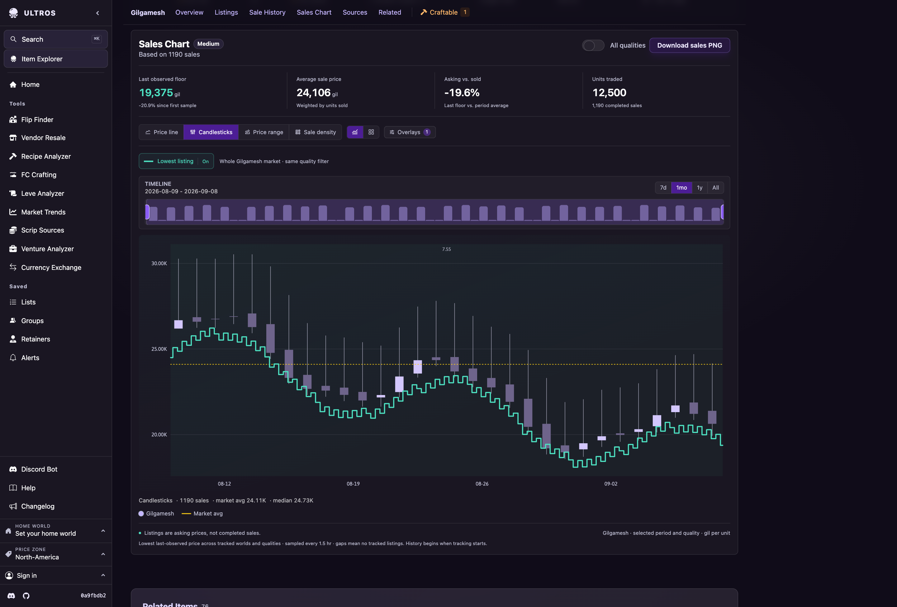
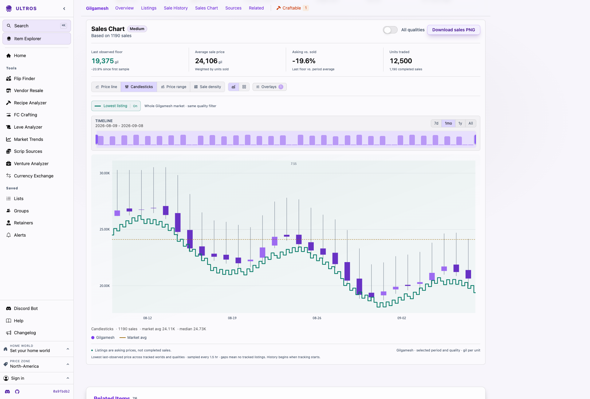

# Market history

The item page combines `price_series` with a new
`GET /api/v1/floor_history/{world}/{itemid}?hq=any&from=...&to=...` endpoint.
Both use the same item, scope, quality, and requested time window. The overview
combines sale buckets using total gil / total units, never averages of medians.
The existing PriceHistoryChart engine is the only chart inside the redesigned
summary card. Price, Candles, Range, Density, grouping, world filters, grid views,
overlays, timeline dragging, and existing URL state remain directly available.
Listing history is a scope-wide stepped overlay in the shared gil coordinate
system for Price/Candles/Range, including its axis bounds and tooltip values.
The floor toggle is URL-backed (`floor=false` hides it). It stays visible with
an explanation when unavailable in Density, per-series Grid, or percent-indexed
Price views. It never changes sale counts, candle bodies, or volume.
Summary totals and the listing floor cover the selected market and quality;
hiding individual sale series does not redefine the scope-wide floor.

## Listing floor semantics

`floor_changes` records the analyzer's observed world-level cheapest listing
for each item and quality. Zero means the board emptied. The query seeds each
world/quality from its last observation before the window, samples the state at
interval ends, and only then takes the minimum positive price across the scope.
This handles quiet worlds, removed undercuts, and HQ/NQ independently. Empty
markets render gaps. The line describes last-observed state, not guaranteed
real-time market-board availability; it does not infer missing earlier history.

Responses contain at most 481 samples, with a minimum interval of one minute.
Changes within an interval are represented by its closing state, so brief
intra-interval undercuts may not be visible. The API reports the interval and the
chart labels it. The source timestamps have one-second precision and no sequence:
for conflicting same-second rows the query deterministically chooses the lower
price (including zero) instead of claiming an ordering the source cannot provide.
Responses are cached for 60 seconds, and database queries have a 15-second limit.

The checked-in schema currently sets `listing_events` retention to **365 days**.
`floor_changes` has **no TTL**. An older deployed `listing_events` table may still
have a different TTL: startup uses `CREATE TABLE IF NOT EXISTS`, which does not
alter existing retention. Confirm a deployment with `SHOW CREATE TABLE
listing_events` and `SHOW CREATE TABLE floor_changes` before promising its exact
retention. This feature makes no schema or retention changes.

## Validation

- `./check_ci.sh`: required formatting, lint and deterministic Rust tests.
- `cargo leptos build`: native server and browser hydration build.
- `ULTROS_CH_INTEGRATION=1 cargo test -p ultros-clickhouse --test floor_history_smoke`
  against a **disposable** ClickHouse with the usual `CLICKHOUSE_*` environment.
  Exercises real SQL, pre-window seeds, mixed quality, market exhaustion, quiet
  markets, missing scope, and the start of recorded history.
- `BASE_URL=http://127.0.0.1:18180 npm --prefix integration run test:market-history`
  against a built server with listing-floor and sales observations. Optional
  `WORLD` and `ITEM_ID` select the market. Checks chart layers, keyboard inspection,
  identical sales/listing query bounds, responsive layout, and runtime errors.
  Writes desktop/mobile screenshots to `integration/artifacts/`.

## Page integration and themes

The item page owns the Sales Chart heading and card; the chart summary no longer adds a hero header
or nested dark surface. The browser scene renderer accepts a color resolver so
axes, candles, volume, listing floor, and average use semantic CSS tokens.
Theme changes apply immediately without changing chart geometry or PNG colors.

`BASE_URL=http://127.0.0.1:18180 node integration/market-history-themes.cjs`
checks light/dark rendering and captures the chart inside the actual item page.
Preview screenshots use illustrative data in disposable local databases.

Final 2026-09-08 checks passed: `check_ci.sh`, browser/server builds, the full
market-history interaction probe, and item-view layout at nine widths. Theme QA
covers all 12 palettes in light and dark mode, waits for color transitions to
settle, checks axis/selected-control text and listing-stroke contrast, and proves
palette changes preserve the listing path geometry. The eight-row page fixture
does not exercise the existing tables' expansion controls; the layout probe
explicitly reports those two coverage gaps.

The item-page surface follow-up uses the shared `item-surface` utility for
item details, listings, recent sales, the chart (including its loading frame),
world supply, and the optional comparison card. It uses the existing panel
palette token with an 8px radius, a theme outline, and consistent 12px/16px
responsive padding. These surfaces have no decorative gradient or shadow.
The follow-up passed `check_ci.sh`, server/browser builds, and desktop/mobile
checks in persisted dark and light themes. Browser measurements confirmed all
five visible wells have identical backgrounds, borders, radii, and padding.
Google's external ad script raised `Yl`; it was identified by its script URL
and reported separately. No application browser errors were observed.

The chart heading and jump link are now localized as **Sales Chart**, separate
from the **Sale History** table. Their destinations remain `#market-history`
and `#history`. The chart target is rendered outside its loading transition,
so direct fragment links work before hydration, with room below the sticky
navigation. `integration/item-source-nav.cjs` checks both anchors in SSR and
clicks them at desktop and mobile widths alongside the existing source links.
The naming/navigation follow-up passed `check_ci.sh`, `cargo leptos build`, all
ten route/width cases in that probe, and a focused chart deep-link reload check.

## Screenshots

Illustrative data from disposable local databases.

