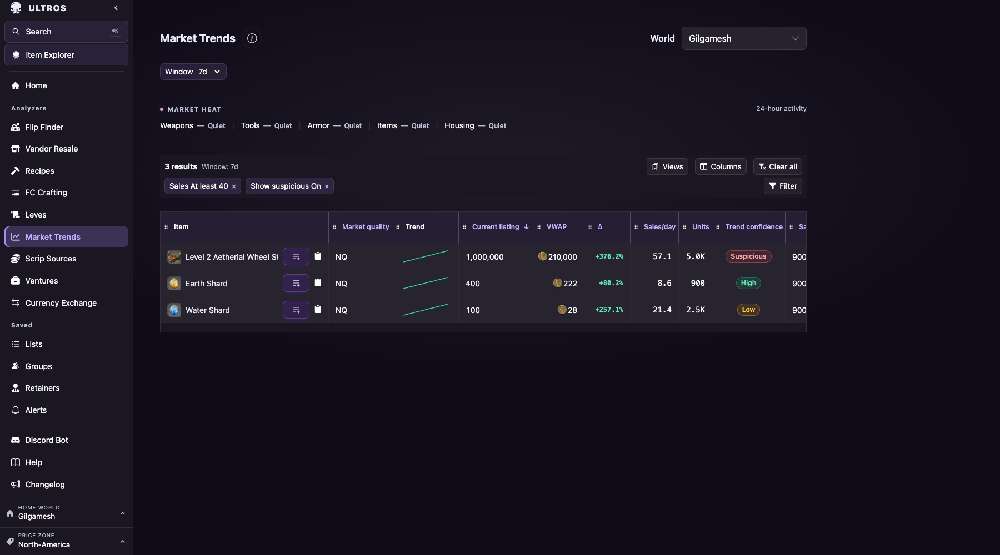

# Trends on the shared market grid

Issue #1344 moved Market Trends from its own div table, sort tokens and chip
row onto `MarketGrid`. The page keeps its 500-row candidate set from
`get_trends_v2`, the 30-day default with 7/30/90-day choices, and the
suspicious-sales control; the grid supplies the Columns picker, sale-history
columns, header sorting and the shared filter bar.

## What changed for readers

- **Old links keep working.** `?sort=units|vwap|price|pct|spd` and `?dir=`
  rank the grid through `SortAlias` entries in the filter registry. The first
  header click rewrites the token to the canonical `grid:<id>` form.
  `?min_sales=` and `?min_price=` are `FilterAlias` entries onto the `sales`
  and `market-listing` metrics and appear as editable chips.
- **Native statistics stay native.** VWAP, price change, sales/day, units,
  sales and confidence come from the deep-scan's cleaned sample and follow the
  suspicious toggle, so they are registered as their own metrics under a
  "Trend scan" picker heading. The `sale_stats` follow-window columns count
  every recorded sale and their confidence is a seven-day fact; they are
  offered beside the native ones, not merged with them.
- **Shared identity columns.** Each row maps to its exact item, quality, world
  and observed listing; `market-quality` replaces the old HQ chip and
  `market-listing` replaces the old Price column.
- **No extra requests by default.** Trends no longer prefetches any
  `sale_stats` body; the selected window loads only when a shared history
  column is visible, filtered or sorted.

## Verification

`integration/shared-analyzer-data.cjs` gained a Trends probe under
`CHECK_ANALYZER_ROUTES=1` using a deterministic `/api/v1/trends` fixture. It
covers an old bookmark (`sort=units&dir=asc&min_sales=40&window=90`), header
sort and direction toggle, the `price` alias landing on the listing column,
the display-only sparkline, the Columns picker adding `market-sale-median`
and triggering exactly one 90-day `sale_stats` request, a window change to
7 days re-requesting both bodies, the suspicious control changing the trends
request, reload, hide-column and Clear all preserving window and sort.

Run on 2026-09-09 against a debug build with the fixture
(`BASE_URL=... CHECK_ANALYZER_ROUTES=1 ANALYZER_TOOLS=trends npm --prefix integration run test:shared-analyzer-data`):

```
CHECK trends: navigating
CHECK trends: grid ready
PASS trends: legacy sort/filter aliases, shared header sorting, columns picker, window changes, suspicious control and reload on the shared grid
```

The probe's evidence capture, taken after revisiting the saved URL: the
aliased Min sales chip and the suspicious control as shared chips, the
canonical `grid:market-listing` sort, the picked Sale median column and the
7-day window all restored.


