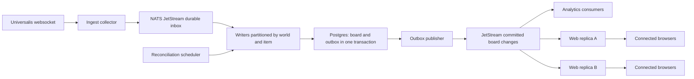

# Future durable ingest and web replicas

Status: architecture sketch, not an implementation commitment. Reconciliation
for #1178 is the immediate priority; no broker or deployment changes are included.

The owner reports serving 12 TB of traffic from one Rust instance with solid
performance (no reporting period specified). The motivation is eventual cloud
redundancy and independent scaling of web replicas, not a demonstrated current
throughput problem. First extract an independently deployed ingest process from
the same repository/image; do not require a broader microservice rewrite.

## Contracts to establish

- Acknowledge inbox processing only after its database transaction commits.
  Handle redelivery idempotently. Broker acknowledgement is not an atomic commit
  across PostgreSQL and NATS; record processed identities transactionally.
- Write the outgoing event into a transactional outbox alongside the board change.
  Retry publication safely; avoid the crash gap between a DB write and publication.
- Preserve local received ordering per `(world, item)`, including both qualities;
  parallelize different partitions. A local sequence does not prove upstream
  causality. Define listing identity, reprices, deduplication windows, and handling
  of ambiguous events before overlapping collectors.
- Snapshot reconciliation participates in the same board ownership/version rules
  so an older fetched snapshot cannot silently overwrite a newer local event.
- Each web replica receives the events needed by its connected browsers. Do not
  put replicas in one competing-consumer group that sends an update to only one
  replica. Carry board revisions; gaps trigger authoritative refetches.
- On ingest deployments, overlap subscription establishment, transfer ownership
  with fencing, drain accepted work, and reconcile any uncertain interval. HTTP
  readiness alone does not prove subscription readiness or complete catch-up.
- JetStream protects captured messages. Events missed before capture still need
  reconciliation. Neither a broker nor rolling deployment removes that need.

## Staged delivery

1. Reliable reconciliation and observable board convergence.
2. Ordered/bounded ingest with durable retry and shutdown recovery.
3. Independently deployed ingest worker and transactional outbox.
4. JetStream retention/replay and separate analytics/web consumers.
5. Multiple web replicas, then redundant collectors with explicit ownership.

Before choosing capacity/retention: measure events and bytes per second, peak
bursts, outage budget, storage/replication cost, consumer lag, Postgres connection
budgets, and the cost of replay. Exercise duplicate delivery, crashes before and
after commit/ack, snapshot races, consumer gaps, collector failover, and loss of
the broker's quorum. Alert on oldest unprocessed event and oldest unverified
board; websocket receipt rate alone is insufficient.

References: [JetStream persistence/replay](https://docs.nats.io/concepts/jetstream),
[RabbitMQ reliability considerations](https://www.rabbitmq.com/docs/reliability).
