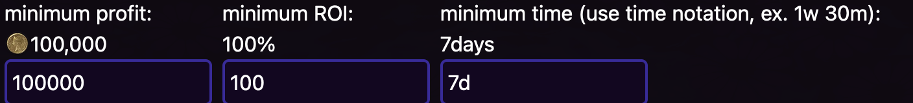

# Flip Finder

The core of Flip Finder is the ability to find items that are cheaper on other servers.

```bob

how to make gil as an ascii diagram

   *---------------*   travel to   *-----------------*
   |  Sargatanas   |<--------------|   Your server   |
   |  Bronze Ingot |   sell back   |                 |
   |   10gp x 100  |-------------->|  1,000gp x 100  |
   | 1,000gp total |               | 100,000gp total |
   *---------------*               *-----------------*
           
           100,000gp - 1,000gp = 99,000gp profit
```

## Getting started

Navigate your browser to the [Flip Finder](https://ultros.app/flip-finder)- if you've set your homeworld, you should be able to just click on the flip finder button and have it navigate you directly to your homeworld, otherwise, select your homeworld from the dropdown.

## Sorting & Filtering

### Filtering
The top row contains several options for filtering that are just textboxes


- Minimum profit - Calculates how much money you could earn from buying and selling the item
- Minimum ROI - The % that your money would increase- with a 300% r.o.i. for every 1 gil you spend, you could earn 3 gil in return.
- Minimum time - This takes the average time between sales from the last 4 sales. This can be a little inaccurate if someone has just purchased, but is generally useful.
- World & Datacenter - You can filter the query down to just a single world by clicking on the world in the flip finder itself, unclear it by clicking the label at the top

### Sorting

Sort by investment changes the table to be ordered by how much money will be earned per gil spent.

This is often best combined with a healthy minimum profit setting- but can be very helpful if you don't have much gil to start with.


Sort by profit changes the table to be ordered by how much total profit will be earned

Consider setting a minimum ROI of around 100% when using this. This can be helpful when you have limited spaces in your inventory.

