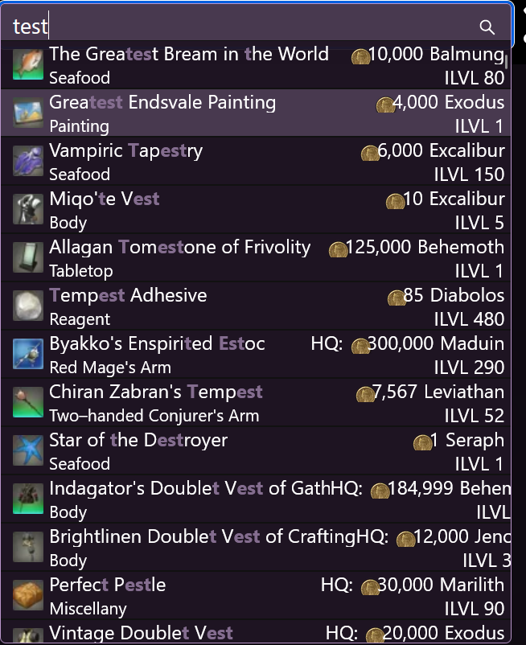

# Setting a home world (and price zone)

To make the most out of Ultros, you should set your homeworld. This will enable prices to show up in [search](../search/search.md), and within the [item explorer](../item_explorer.md).

On the website, head to [settings](https://ultros.app/settings) and you should see a page like this.

Simply choose your world and price zone and you should start to see prices show up in search.

Note that this will have to be done on each device that you access Ultros from as currently this is not stored in the database but just stored as a local cookie.
