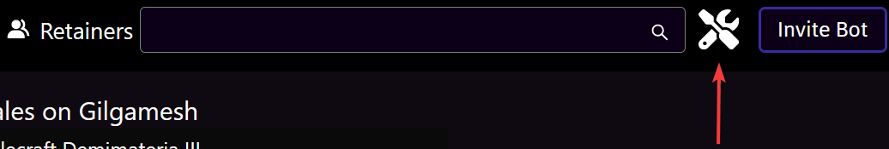
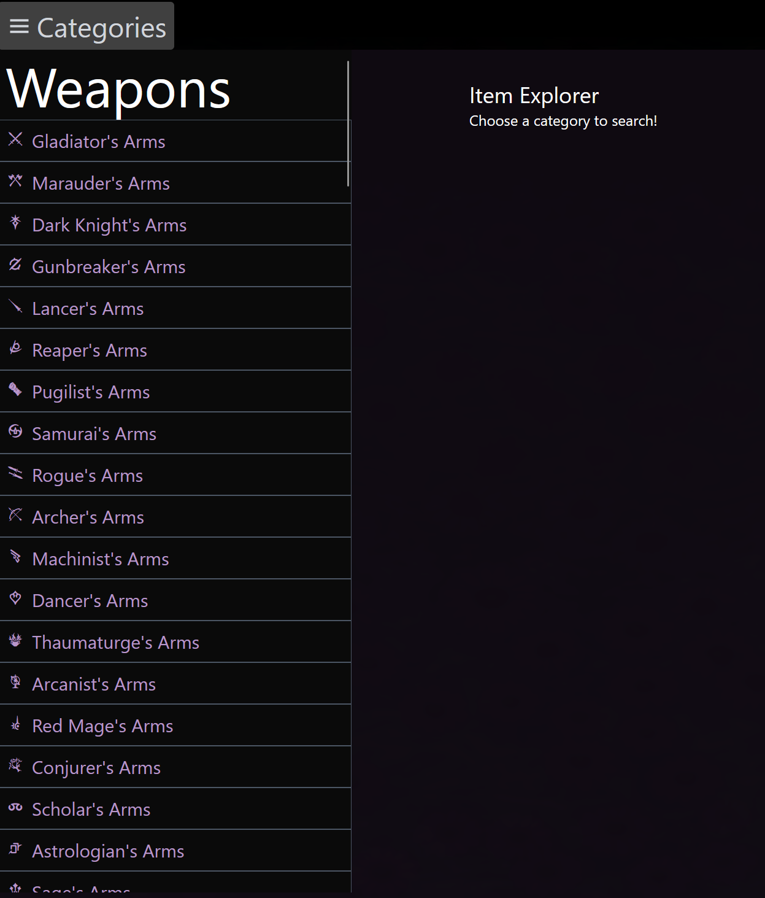
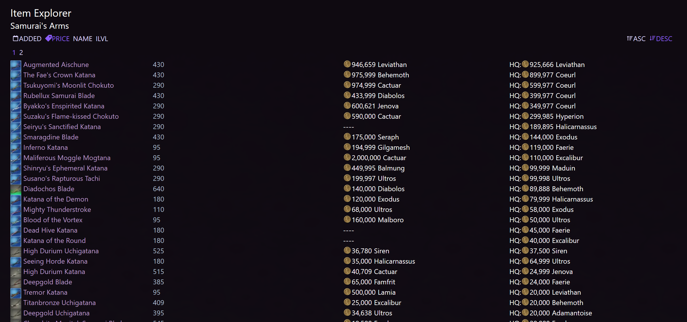

# Item Explorer

Ultros' item explorer is useful when you want to find items that you might not know the name of. It allows you to sort by price, ilvl, name, or when it was added to the game.

Note: The item explorer is only available via the website.

## Navigating to the item explorer
To use to the item explorer, click the wrench and screwdriver next to the search box.

From there you can select an item category. The first several categories will match the categories found on the ingame market board, and the last buttons will just show you all of the gear that is available for a class.

## Sorting

The following sorting options are available
- ADDED - When the item was added to the games files (this may not always make sense)
- PRICE - (note: By default, the item explorer will use prices from your price zone- see [set your home world](./intro/homeworld.md) for how to configure)
- NAME - Sorts alphabetically by the item's name
- ILVL - Sorts by the most expensive

This enables you to search for say, [the most expensive minion](https://ultros.app/items/category/Minions?sort=price), or the [most recently added samurai gear](https://ultros.app/items/jobset/SAM?sort=key)

