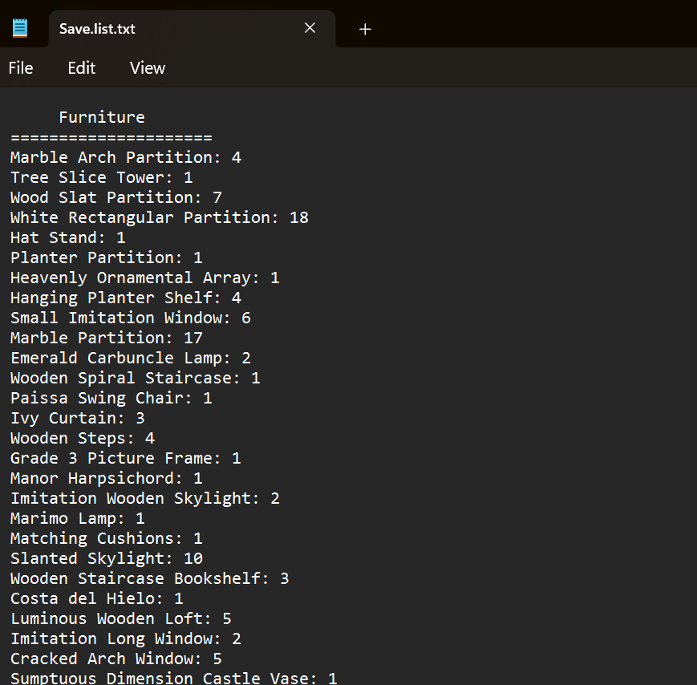
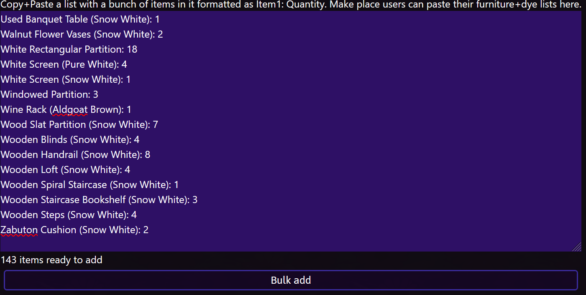

# Importing a Makeplace List

This guide will walk you through uploading the txt file from MakePlace into an Ultros list so that you can use it as a shopping list.

Note that this feature currently only supports marketplace items, any items not obtainable on the marketboard will be skipped in the list.

## Getting the txt from makeplace

When you save in Makeplace it will also save a .txt file along side the .json file that contains all of the items that you want to use for your house.

Usually this file is found in the MakePlace directory in "Save"

## Importing into a list

Open the list that you wish to add all the makeplace items to and then press the "Make Place" button at the top of the page.

Copy the txt file from the previous step into the text box. You should see "x items ready to add" at the bottom.

When ready, press "Bulk add" and the list should update with the newly added makeplace items.