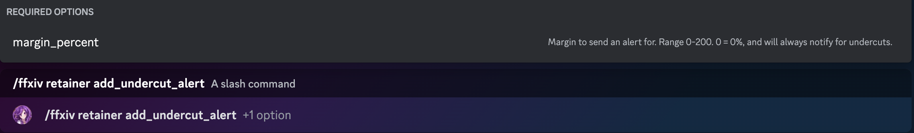
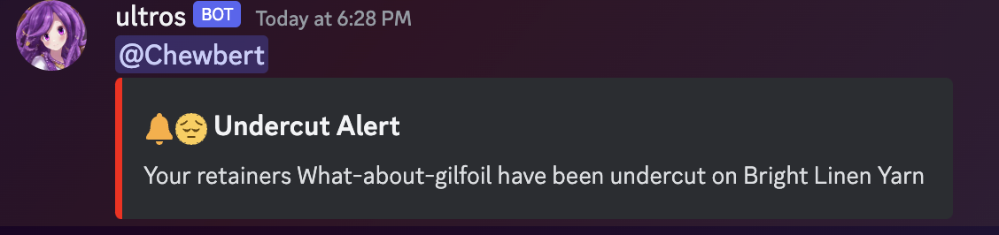

# Retainer Undercut Alerts

Ultros is able to send a Discord message to a channel whenever one of your retainers gets undercut.
The bot must be added to your Discord server, so ensure you've [invited the bot](https://ultros.app/invitebot)

## Adding alerts to a channel
Currently ultros only supports alerting via Discord.

Once you've added retainers to your account, you can request to get alerts from the bot using `/ffxiv retainer add_undercut_alert`

If you have the bot in the server you're in, it should look something like this:

Once you use this command in a Discord channel- it should send an alert similar to this to that channel.

By default, alerts will mention you and look like this

## Turning alerts off
To remove alerts from a channel, you may use the `/ffxiv retainer remove_undercut_alert` command to stop alerts from being sent to a channel