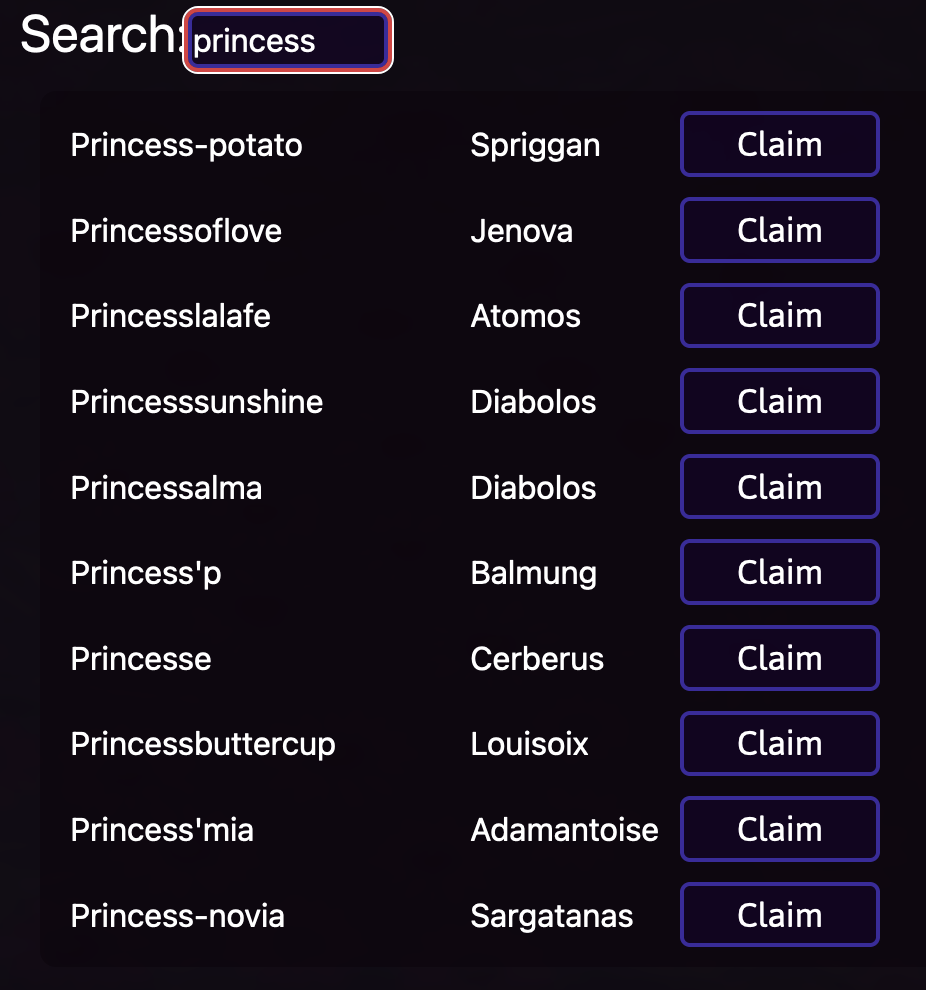
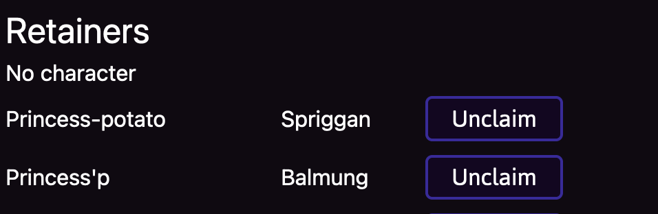
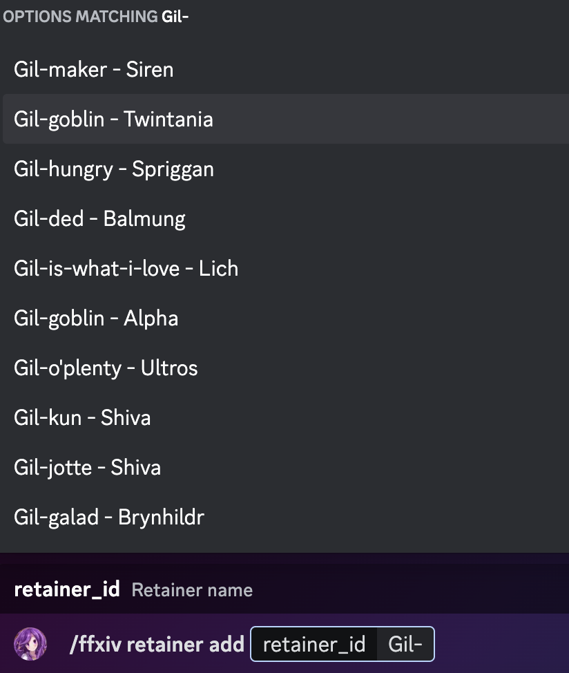

# Managing retainers

This chapter covers managing retainers via the [website](#using-website) and [discord](#using-discord).

## Using website
Once you're logged into [ultros](https://ultros.app/retainers/edit) you should be able to join the server.
https://ultros.app/retainers/edit

From there- you should be able to see all of the retainers that you have added to your account. in a table and a search bar.

### Adding a retainer

Type the name of your retainer into the search box and then click the claim button when the retainer shows up.

### Updating retainers
Once you have retainers added, you should see them listed here:

It is possible to associate a retainer to a specific character, which is why we see "No character" above. Character management is covered [here](../characters/character.md)

To reorder the retainers (I highly suggest you match the order of your retainers in game), you may simply drag and drop them.

To remove them, you just need to click unclaim!

## Using Discord

### Adding a retainer on Discord

In discord, use the command
`/ffxiv retainer add retainer_name` to add a retainer. As you type the retainer name, the autocomplete should show the name and server of the retainer like this.

make sure you click on the retainer and server that matches yours. Typing th complete name won't work- it must be chosen from the autocomplete list.

### Remove

`/ffxiv retainer remove`

### List

You can check the list of all of your retainers with
`/ffxiv retainer list`