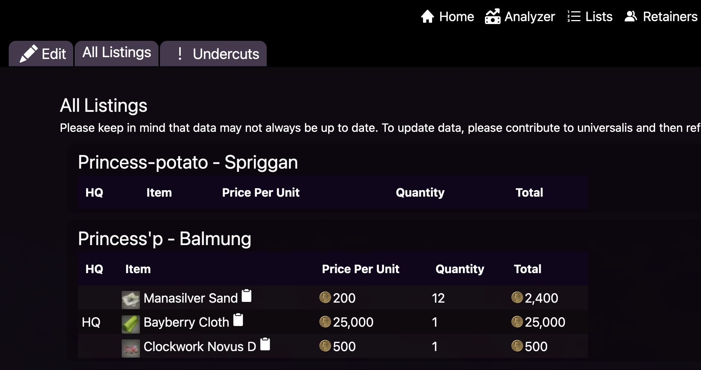
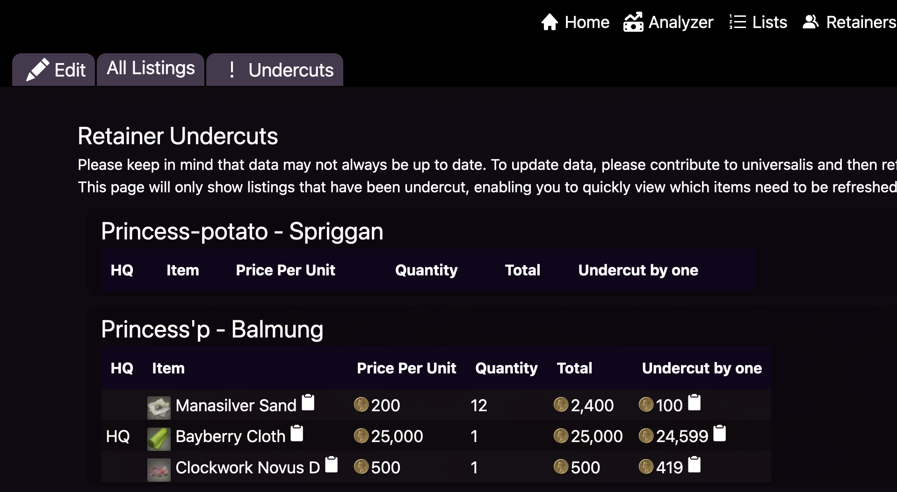
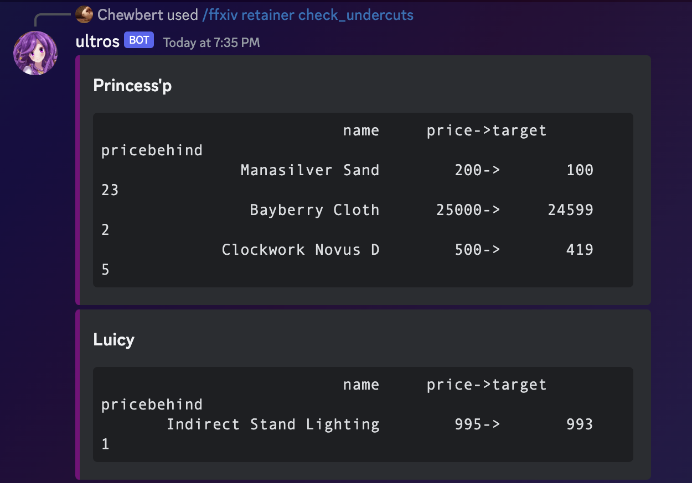

# Tracking retainers

Once you've gotten retainers, you should now be able to view their listings that Ultros is aware of. 

## Website

The website should be fairly intuitive. Just click on [retainers](https://ultros.app/retainers/listings), and then all listings and you should see this page.

This page shows all of the listings that are currently known to Ultros that belong to your retainer. This likely won't match what your retainer sees in game, but this should match what people searching Universalis and Ultros should see.

The more useful page is the [undercuts page](https://ultros.app/retainers/undercuts) which shows just the listings that your retainer has been undercut on.

The undercut by one option shows the lowest price minus one, thus is the price you need to be the cheapest on the marketboard.

Any listings that aren't undercut aren't available on this page.

## Discord

* `ffxiv retainer check_listings` will show all of your retainer's listings
* `/ffxiv retainer check_undercuts` will show just the listings that you've been undercut on.

